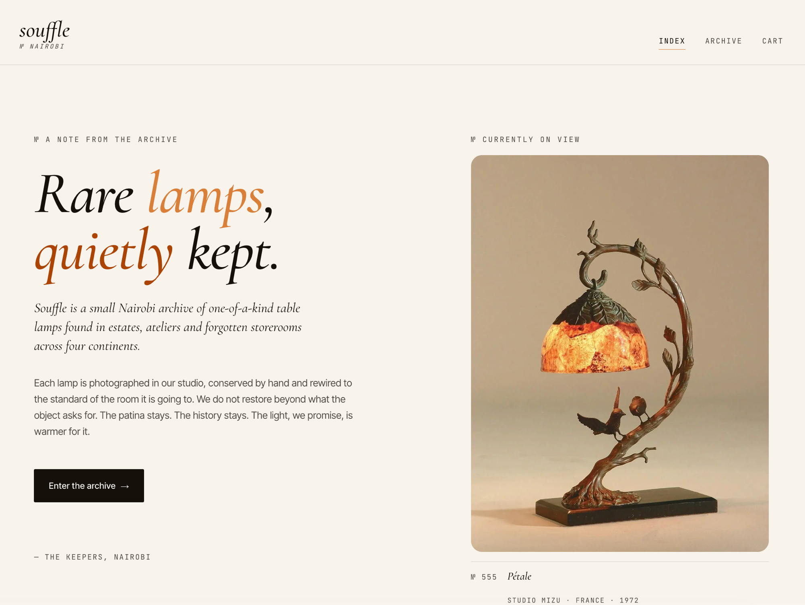

# Advanced Web Design and Development

## Souffle — E-Commerce Platform for Table Lamps

A full-stack e-commerce platform for rare table lamps sourced from around the world. Built as the capstone project for this unit, using a modern TypeScript stack throughout.



**Stack:** Next.js · React · TypeScript · TailwindCSS · Convex · Convex Auth

→ [View capstone project](./capstone-project)  
→ [Live repo: Ian-Chege/souffle](https://github.com/Ian-Chege/souffle)

---

## Weekly Work

| Week | Topic | Folder |
|------|-------|--------|
| 1 | Local Environment Setup | [week1](./week1) |
| 2 | Wireframes and GUI Design | [week2](./week2) |
| 3 | JavaScript Basics and Backend Foundations | [week3](./week3) |
| 4 | Server-Side Programming — Node.js + TypeScript | [week4](./week4) |
| 5 | Database Integration — PostgreSQL + Prisma | [week5](./week5) |

---

## Running the Capstone

```bash
cd capstone-project
npm install
npx convex dev   # start Convex backend
npm run dev      # start Next.js frontend
```

Requires a Convex account and environment variables set in `.env.local`.
