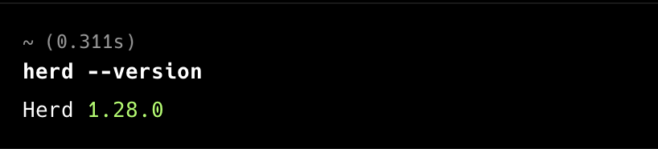
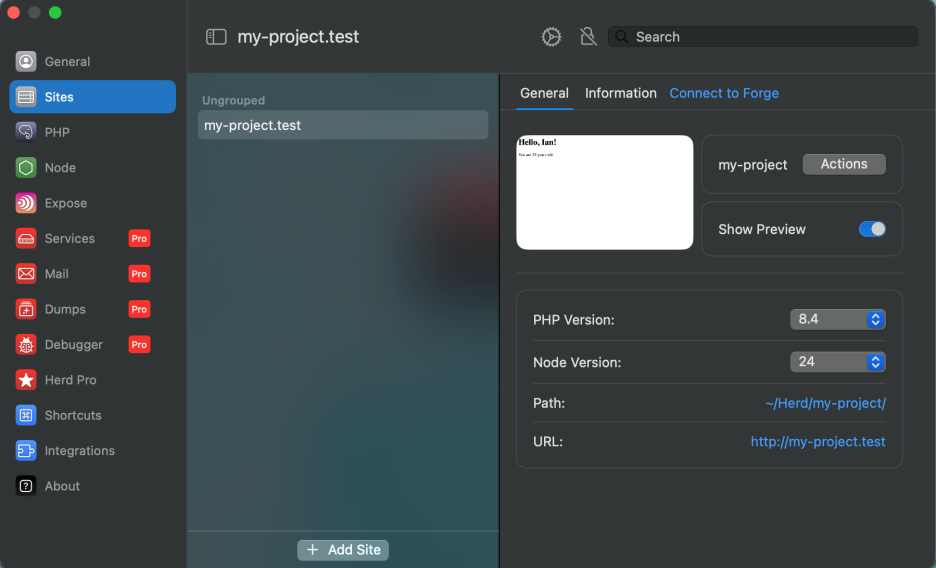
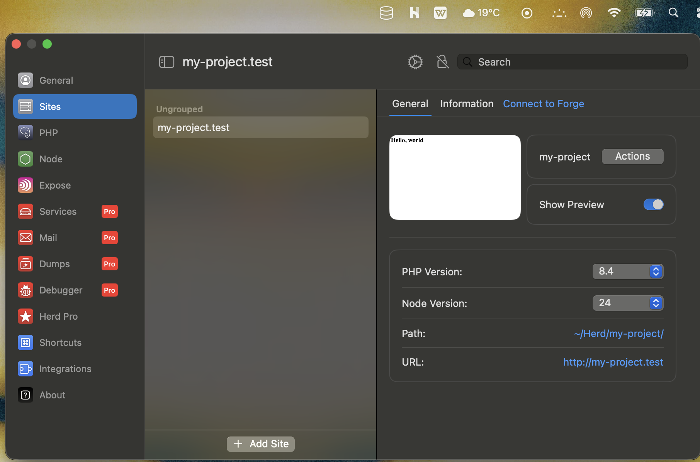
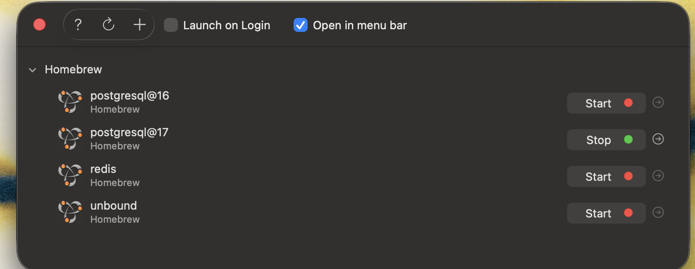
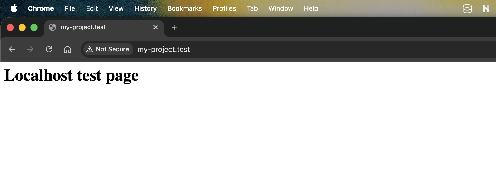
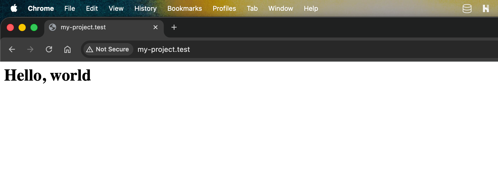
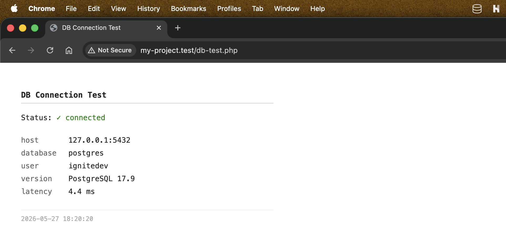
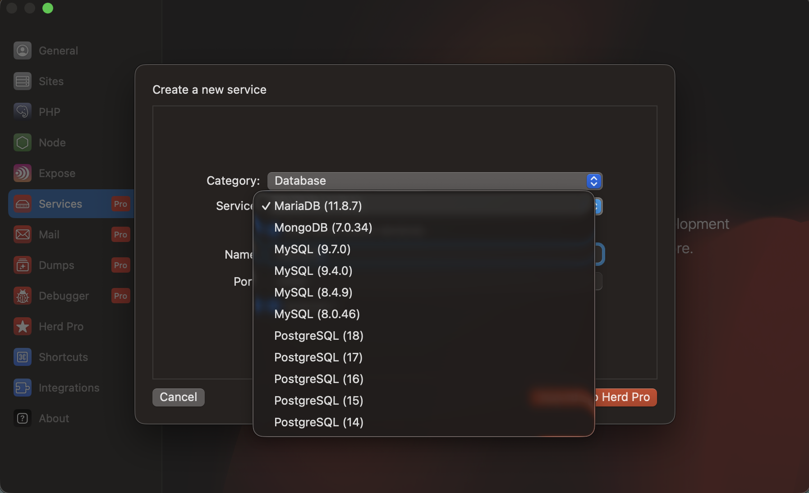

# Week 1 — Local Environment Setup

Setting up a local development environment capable of running a web server and connecting to a database.

## Environment

| Tool | Purpose |
|------|---------|
| Laravel Herd | Local web server (macOS-native alternative to XAMPP) |
| DBngin | PostgreSQL version manager |
| PostgreSQL 17 | Local database |

---

### Fig 1 & 2 — Laravel Herd Installed

### Fig 3 & 4 — Laravel Herd and PostgreSQL Running

### Fig 5 — Localhost Test Page

### Fig 6 — Hello World Test

### Fig 7 — Database Connection Test

### Fig 8 — Laravel Herd Database Support

---

## Key Takeaway

XAMPP caused security conflicts on macOS. Laravel Herd is a modern, well-documented alternative that installs cleanly. DBngin handles database server lifecycle without needing Docker or manual Homebrew setup.
