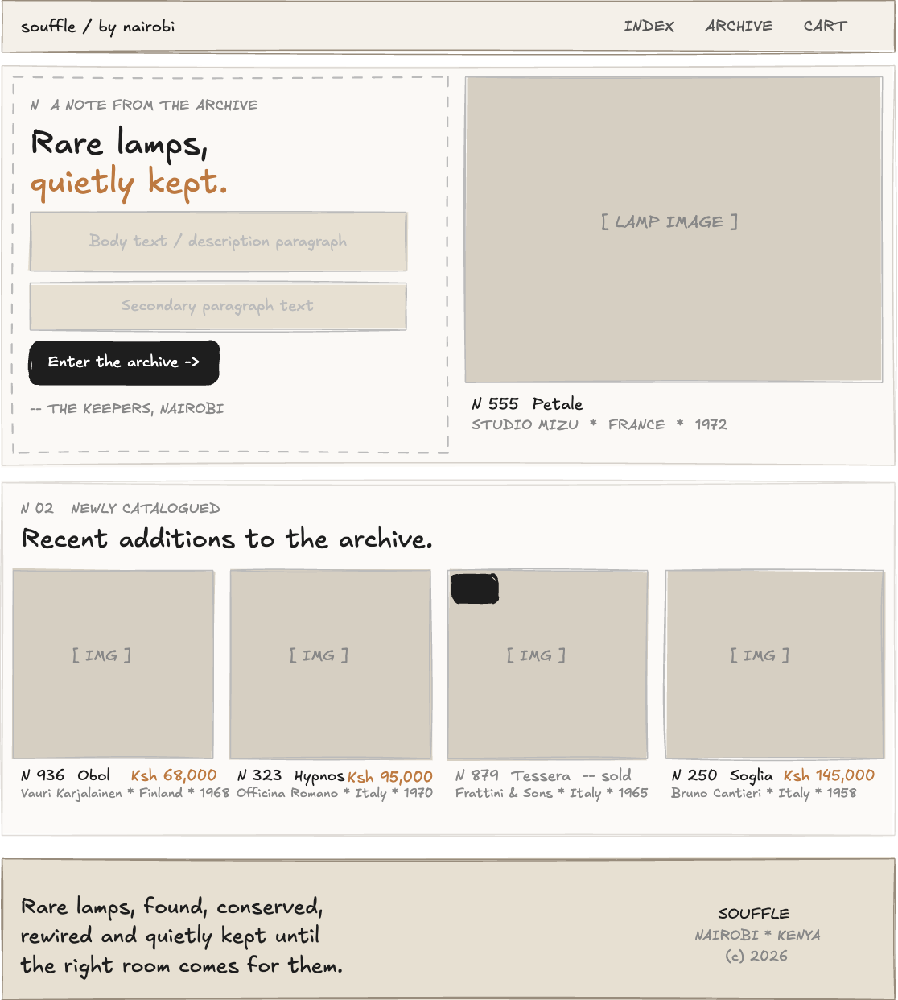
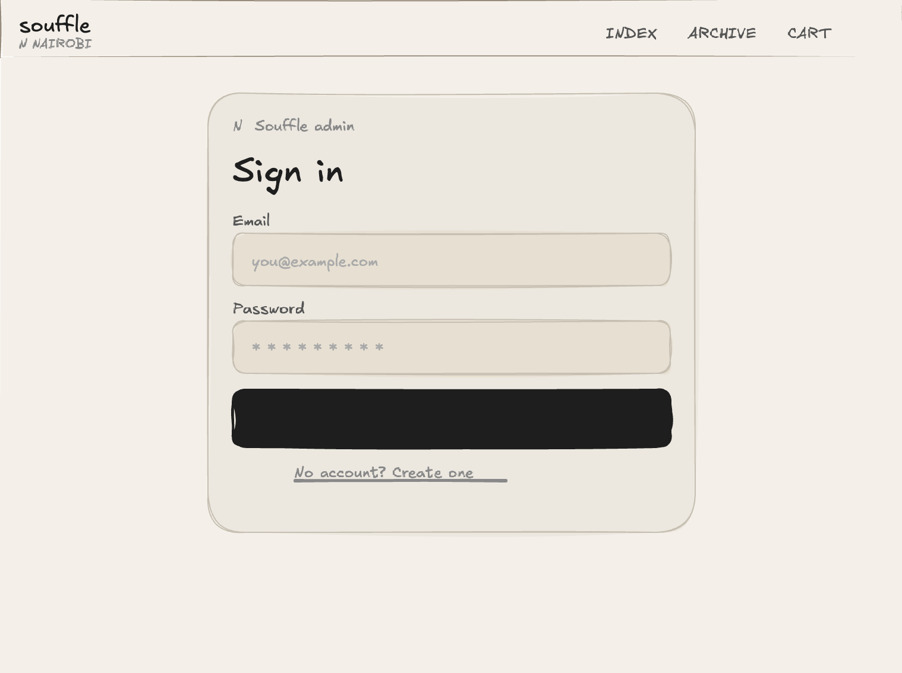
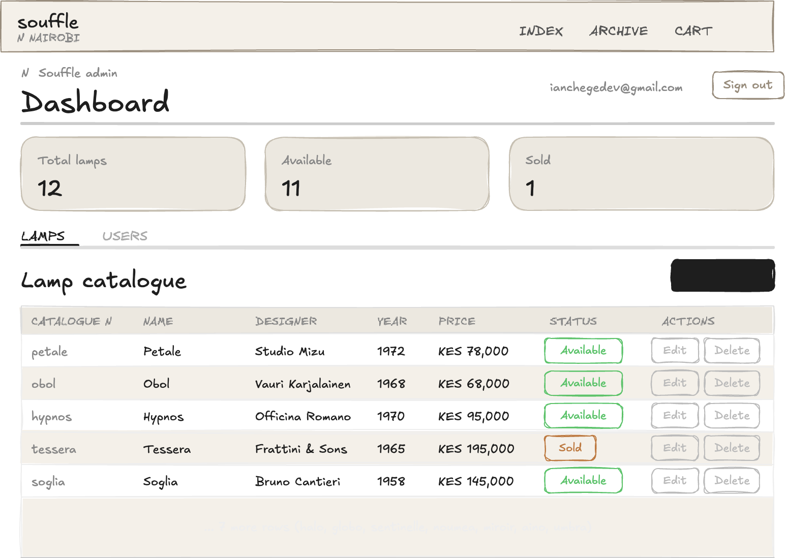
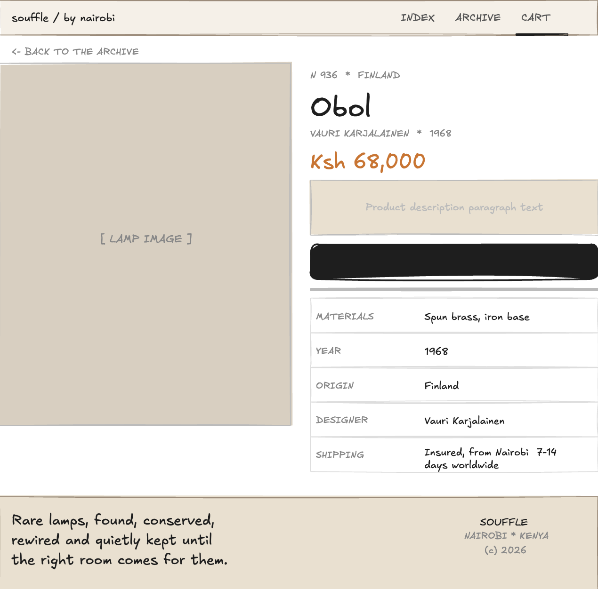
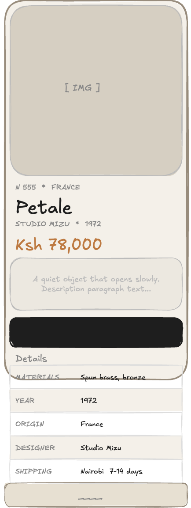
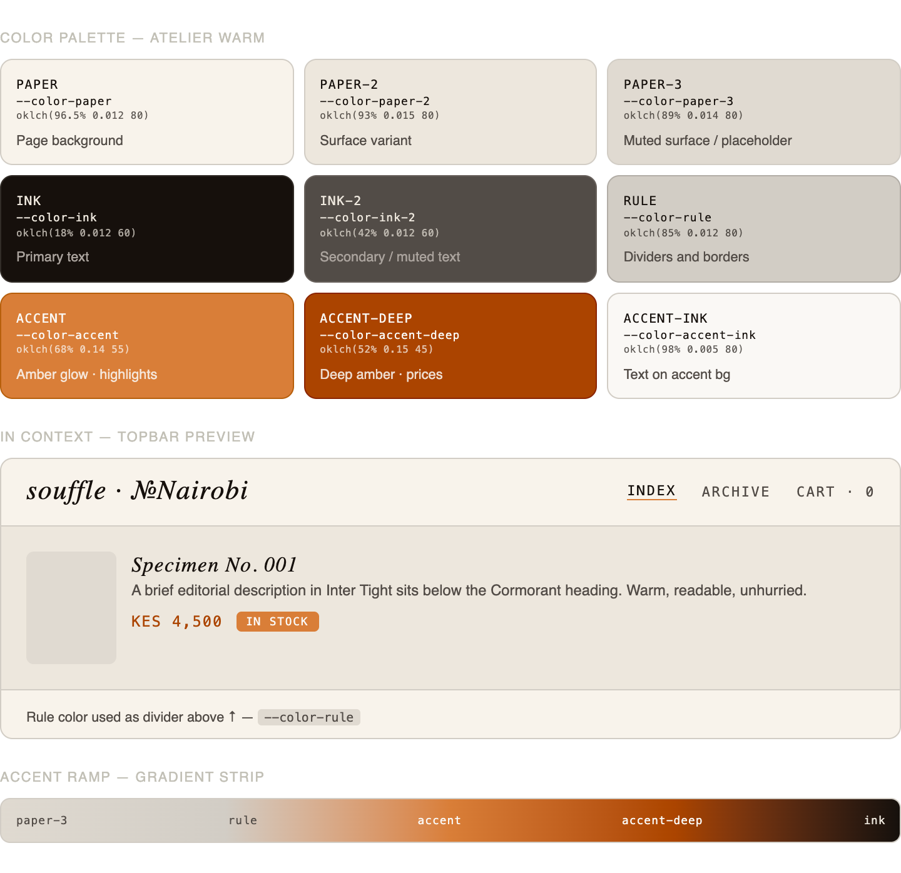
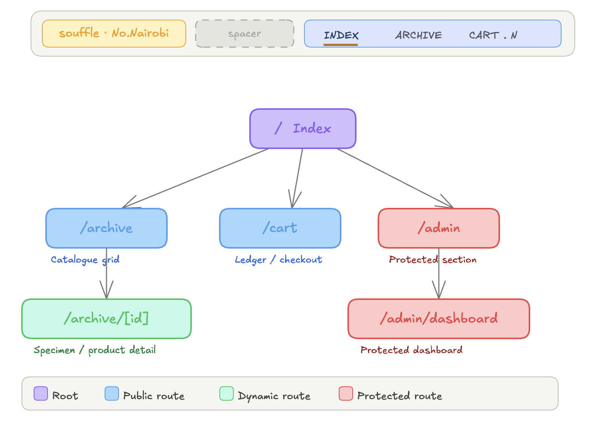
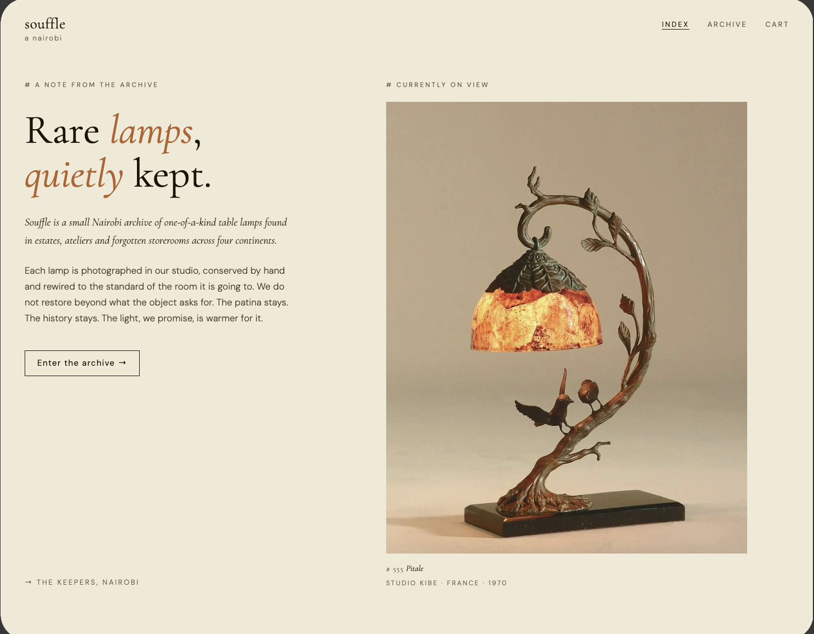
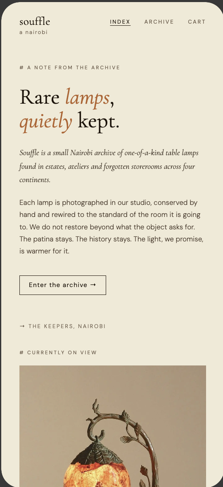

# Week 2 — Wireframes and GUI Design

Planning the user interface and visual identity of Souffle before writing any code.

---

### Fig 1 — Hand-drawn Wireframe (Website)

### Fig 2 — Auth / Sign In Page

### Fig 3 — Admin Dashboard Wireframe

### Fig 4 — Product Detail Page Wireframe

### Fig 5 — Mobile View Mockup

### Fig 6 — Colour Theme

### Fig 7 — Navigation Structure

### Fig 8 & 9 — GUI Prototype (Figma)

→ [Full Figma file](https://www.figma.com/make/7HhKn2v0iuLOZBMrJyc2cI/)

---

## Design Rationale

The amber accent represents the glow of a lamp. The italic serif font signals the rarity and craftsmanship of the products. Navigation follows natural shopping behaviour: Index → Archive → Product Detail → Cart.
