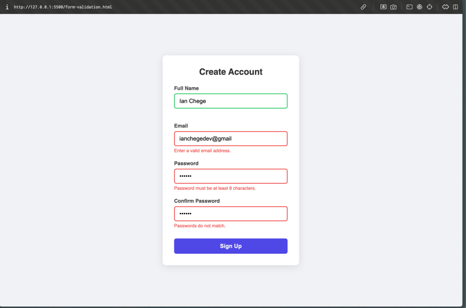
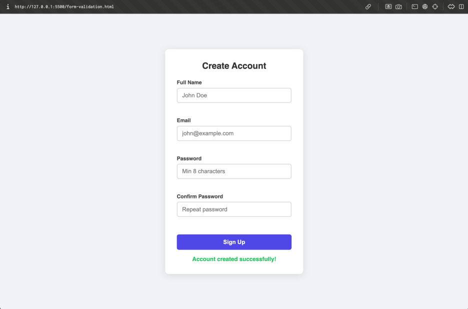
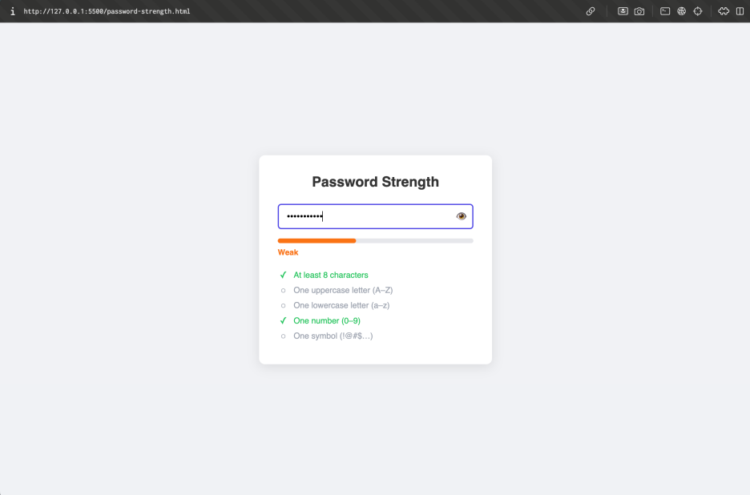
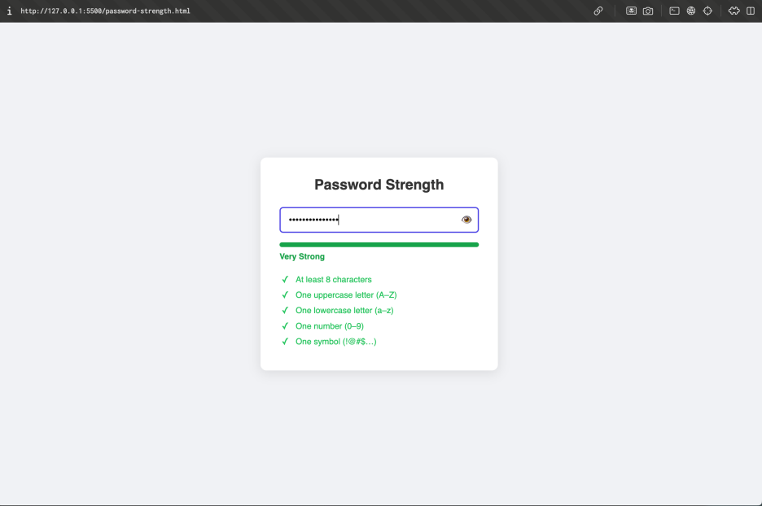
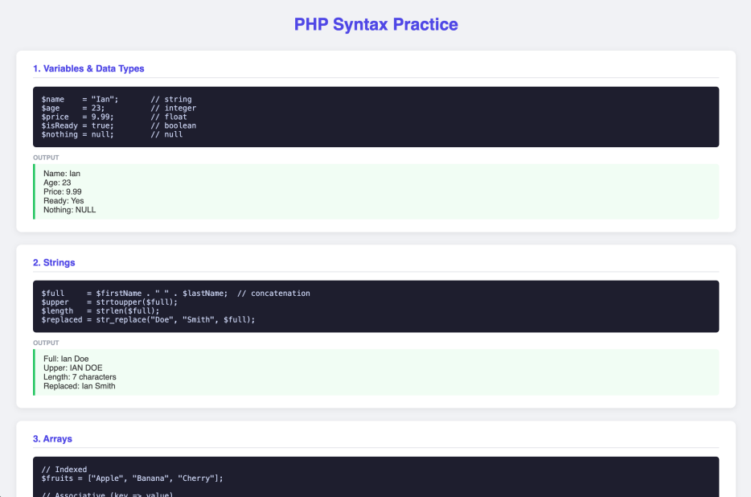
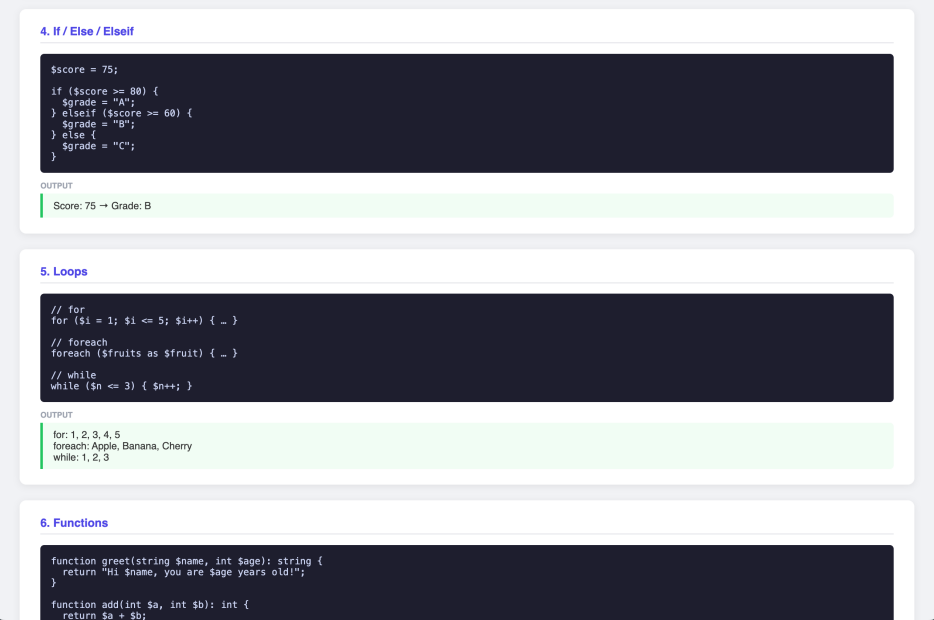
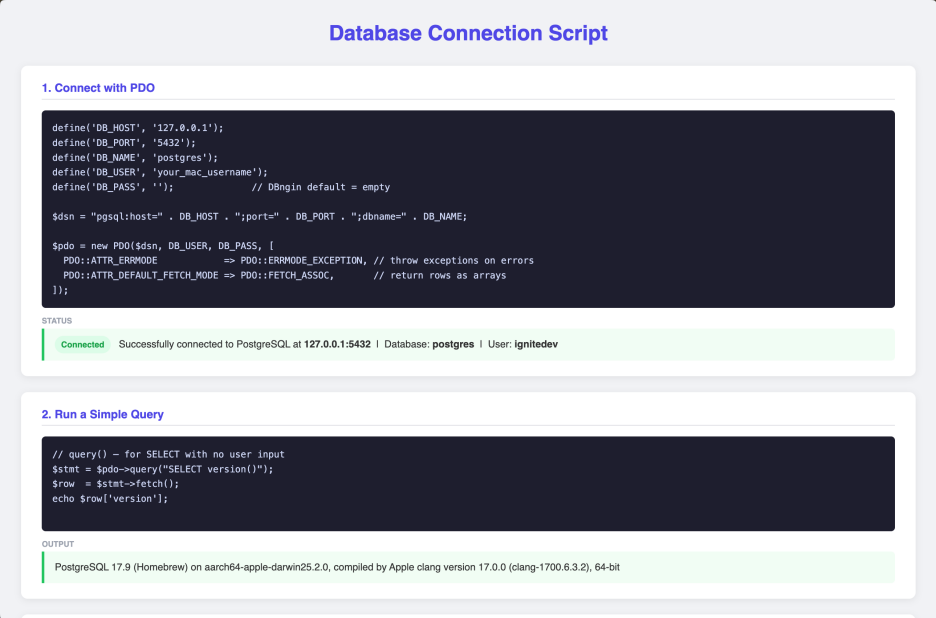
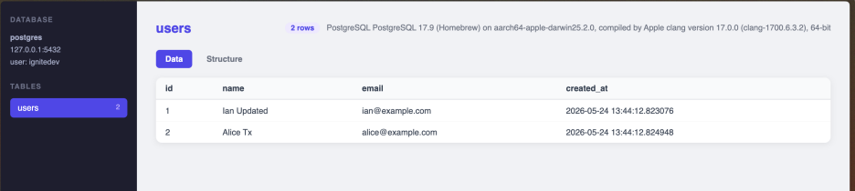
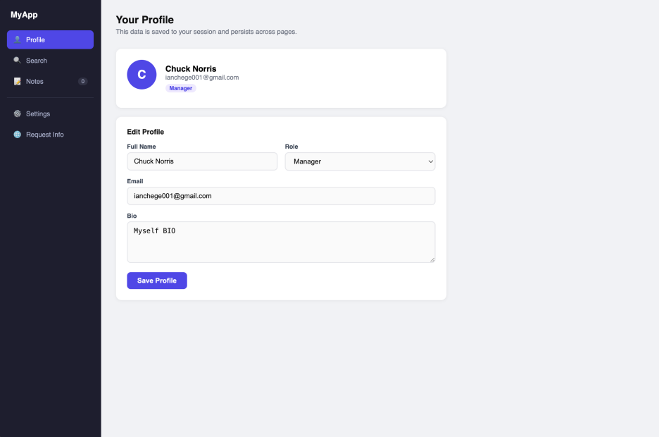

# Week 3 — JavaScript Basics and Backend Foundations

Client-side interactivity with JavaScript and foundational backend concepts including database connectivity.

## Files

| File | Description |
|------|-------------|
| `form-validation.html` | Live form validation with error states |
| `password-strength.html` | Password strength checker with visual bar |
| `php-syntax.php` | Variables, data types, arrays, control flow |
| `user-input.php` | Processing user input from forms |
| `db-connection.php` | Connecting to PostgreSQL and running queries |
| `db-test.php` | Database connection test script |
| `view-table.php` | Fetching and displaying database records |
| `index.php` | Entry point |
| `stack-status.php` | Checks PHP + PostgreSQL stack is running |

---

### Fig 1 & 2 — JavaScript Form Validation




```js
// Validate on input, mark field green/red immediately
document.getElementById('email').addEventListener('input', function () {
  const error = validateEmail(this.value);
  this.classList.toggle('valid', !error);
  this.classList.toggle('invalid', !!error);
  document.getElementById('emailError').textContent = error;
});

// Block submit if any field fails
form.addEventListener('submit', function (e) {
  e.preventDefault();
  const allValid = [validateName, validateEmail, validatePassword, validateConfirm]
    .map((fn, i) => showResult(fields[i], fn(inputs[i].value)))
    .every(Boolean);
  if (allValid) showSuccess();
});
```

---

### Fig 3 & 4 — Password Strength Checker




```js
const rules = [
  { id: 'req-length', test: p => p.length >= 8 },
  { id: 'req-upper',  test: p => /[A-Z]/.test(p) },
  { id: 'req-lower',  test: p => /[a-z]/.test(p) },
  { id: 'req-number', test: p => /[0-9]/.test(p) },
  { id: 'req-symbol', test: p => /[^A-Za-z0-9]/.test(p) },
];

function checkStrength(password) {
  const passed = rules.filter(r => r.test(password)).length;
  // passed → 0–5, maps to: empty / very weak / weak / fair / strong / very strong
  updateBar(levels[password.length === 0 ? 0 : passed]);
}
```

---

### Fig 5 & 6 — PHP Syntax Practice




```php
<?php
// Variables and types
$name    = "Ian";
$age     = 21;
$prices  = [12.99, 24.99, 9.99];

// Control flow
if ($age >= 18) {
    echo "Access granted";
} else {
    echo "Access denied";
}

// Functions
function greet(string $name): string {
    return "Hello, $name!";
}
echo greet($name);
```

---

### Fig 7 & 8 — Database Connection Script




```php
<?php
// db-connection.php — connect to local PostgreSQL via DBngin
$host   = '127.0.0.1';
$port   = '5432';
$dbname = 'postgres';
$user   = 'postgres';

$conn = pg_connect("host=$host port=$port dbname=$dbname user=$user");

if (!$conn) {
    die("Connection failed");
}

$result = pg_query($conn, "SELECT * FROM users");

while ($row = pg_fetch_assoc($result)) {
    echo $row['username'];
}

pg_close($conn);
```

---

### Fig 9 — Dynamic User Input Handling



```php
<?php
// user-input.php — process and display form data
if ($_SERVER['REQUEST_METHOD'] === 'POST') {
    $username = htmlspecialchars($_POST['username'] ?? '');
    $email    = htmlspecialchars($_POST['email']    ?? '');

    if (empty($username) || empty($email)) {
        echo "All fields required.";
    } else {
        echo "Welcome, $username!";
    }
}
```

---

## Key Takeaway

JavaScript on the client validates and improves UX before any data hits the server. The backend processes and persists that data. `htmlspecialchars()` on all user input prevents XSS — never echo raw POST data. A database connection is what makes a web app dynamic rather than static.
