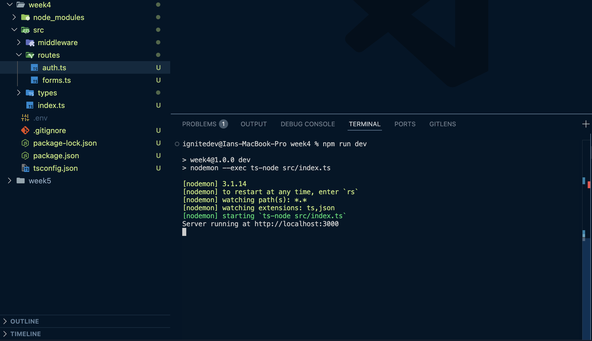
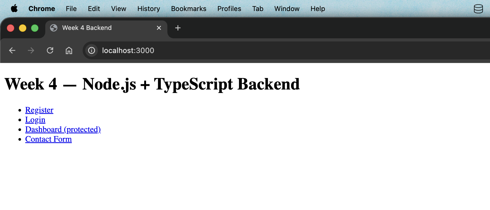
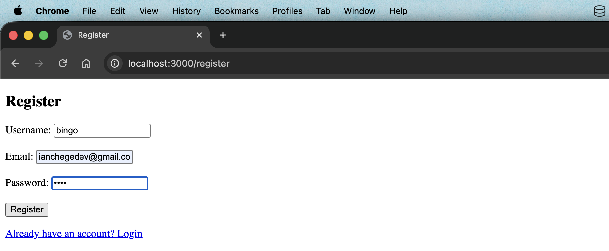
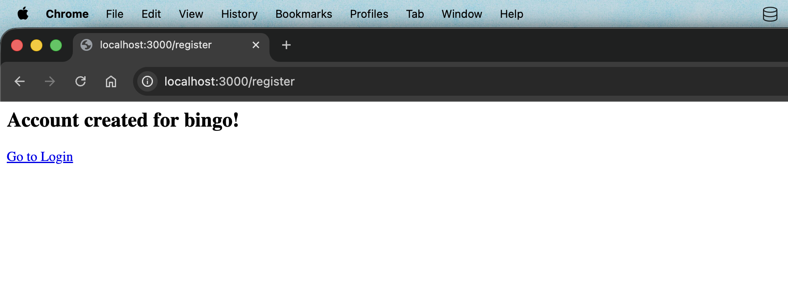
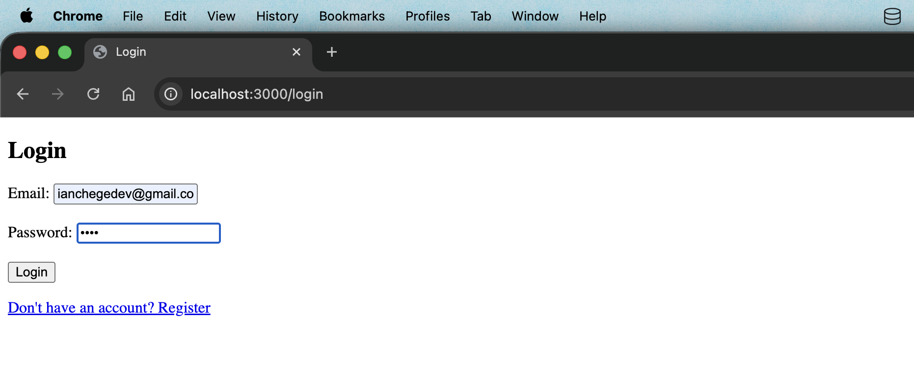
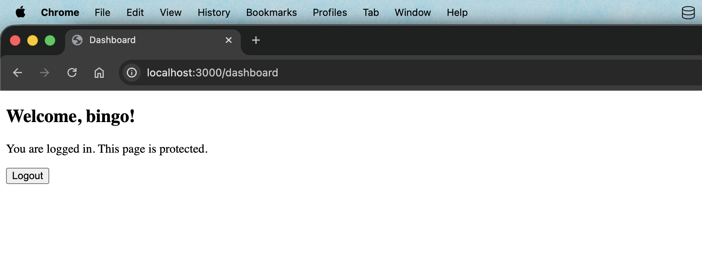
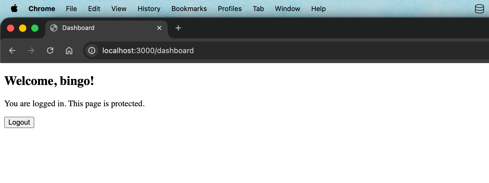
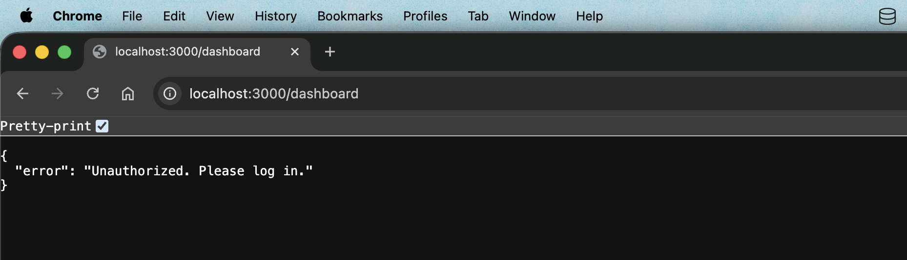
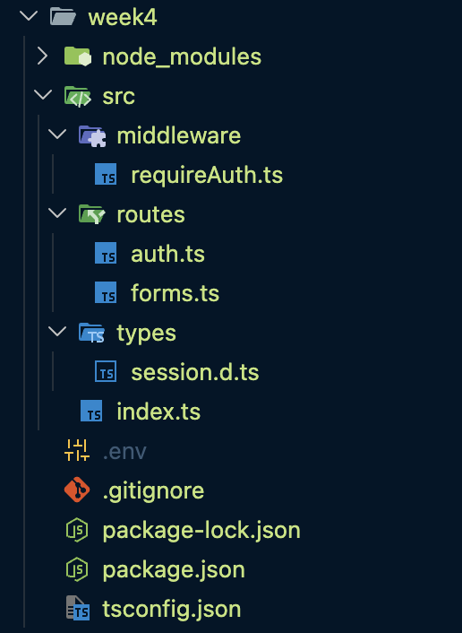

# Week 4 — Server-Side Programming

Dynamic backend processing and user authentication using Node.js and TypeScript.

## Stack

| Tool | Purpose |
|------|---------|
| Node.js 22 | Runtime |
| Express.js | Web framework |
| TypeScript | Type-safe JavaScript |
| bcrypt | Password hashing |
| express-session | Session management |
| DBngin + PostgreSQL 17 | Local database (Week 5 integration) |

## Running locally

```bash
npm install
npm run dev
# → http://localhost:3000
```

## Routes

| Route | Method | Description |
|-------|--------|-------------|
| `/` | GET | Home — links to all routes |
| `/register` | GET / POST | Registration form |
| `/login` | GET / POST | Login form |
| `/dashboard` | GET | Protected — requires session |
| `/contact` | GET / POST | Contact form |
| `/logout` | POST | Destroys session |

## Project structure

```
src/
├── index.ts              ← app entry point
├── routes/
│   ├── auth.ts           ← register, login, logout, dashboard
│   └── forms.ts          ← contact and standalone forms
├── middleware/
│   └── requireAuth.ts    ← session guard
└── types/
    └── session.d.ts      ← extends express-session types
```

---

### Fig 1 — Server Running



### Fig 2 — Home Page



### Fig 3 — Register Form



### Fig 4 — Registration Success



### Fig 5 — Login Form



### Fig 6 — Login Success and Redirect



### Fig 7 — Protected Dashboard



### Fig 8 — Unauthorized Access Blocked



### Fig 9 — Project Folder Structure


