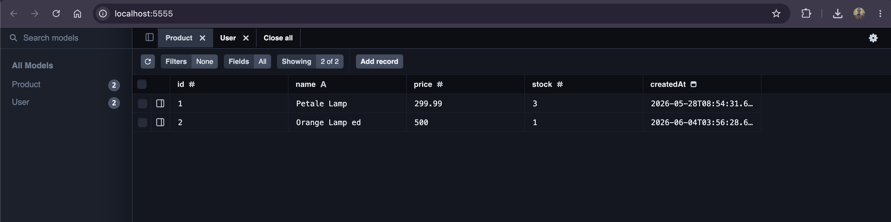
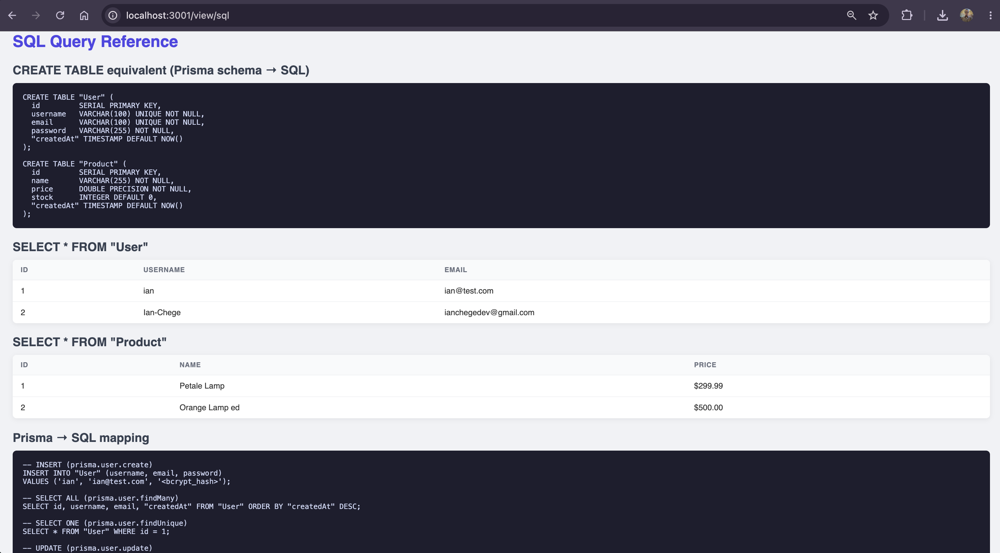
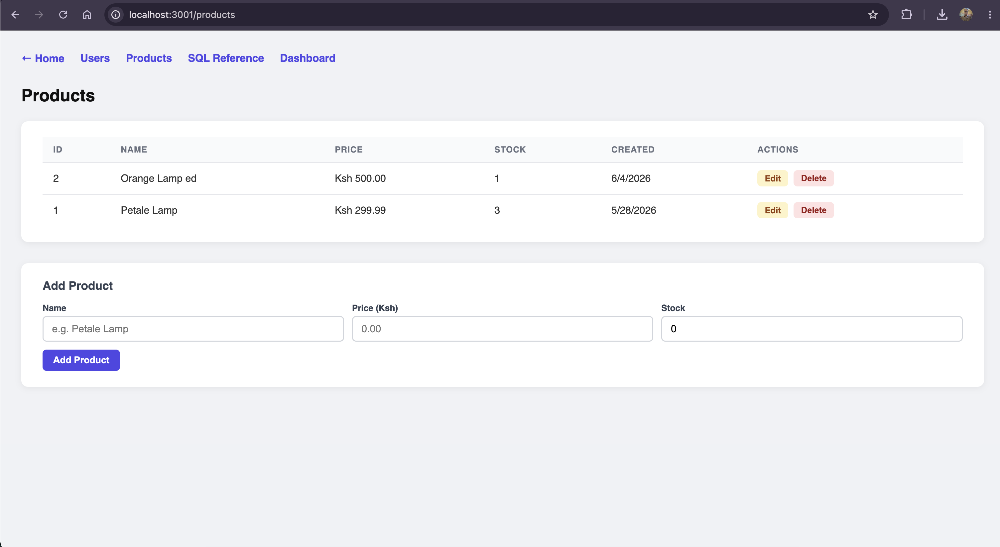
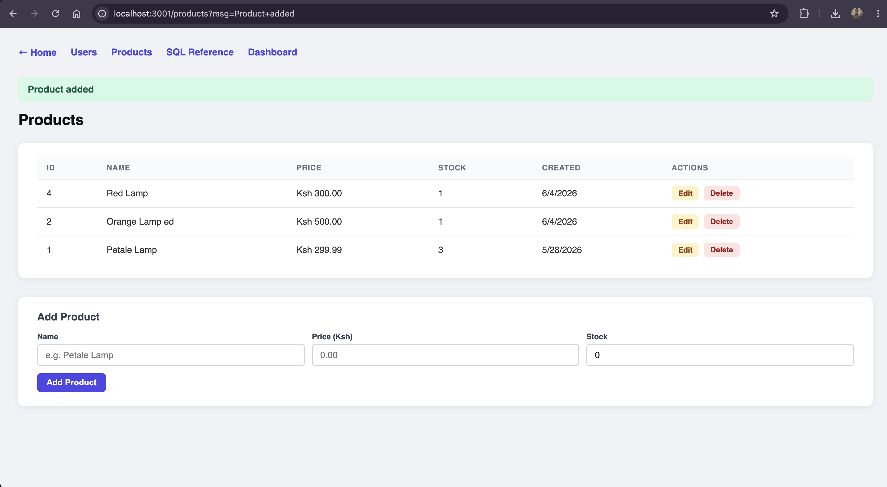
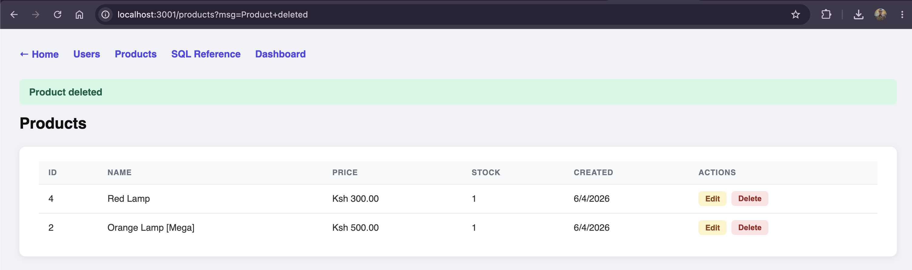

# Week 5: Database Integration

Building data-driven systems by connecting the Express backend to PostgreSQL using Prisma.

## Stack

| Tool | Purpose |
|------|---------|
| PostgreSQL 17 | Relational database (via DBngin) |
| Prisma ORM | Schema management + type-safe queries |
| Prisma Studio | Visual database browser (replaces PHPMyAdmin) |
| bcrypt | Password hashing before DB storage |
| express-session | Session-based authentication |

## Running locally

```bash
npm install
npx prisma db push     # apply schema to local PostgreSQL
npm run dev            # start server at http://localhost:3001
npx prisma studio      # open DB browser at http://localhost:5555
```

Requires `DATABASE_URL` in `.env`:
```
DATABASE_URL="postgresql://ignitedev@localhost:5432/studentdb"
```

## Routes

| Route | Description |
|-------|-------------|
| `/users` | HTML CRUD page: list, add, edit, delete users |
| `/products` | HTML CRUD page: list, add, edit, delete products |
| `/view/sql` | SQL reference: CREATE TABLE equivalents + raw queries |
| `/register` | Register form → stores hashed password in DB |
| `/login` | Login form → validates against DB, sets session |
| `/dashboard` | Protected page: requires active session |

---

### Fig 1 — Database Creation




```bash
# Create the database and push schema in one step
npx prisma db push
# → Your database is now in sync with your Prisma schema
```

---

### Fig 2 — Creating Tables



```prisma
// prisma/schema.prisma
model User {
  id        Int      @id @default(autoincrement())
  username  String   @unique
  email     String   @unique
  password  String
  createdAt DateTime @default(now())
}

model Product {
  id        Int      @id @default(autoincrement())
  name      String
  price     Float
  stock     Int      @default(0)
  createdAt DateTime @default(now())
}
```

SQL equivalent generated by Prisma:
```sql
CREATE TABLE "User" (
  id         SERIAL PRIMARY KEY,
  username   VARCHAR(100) UNIQUE NOT NULL,
  email      VARCHAR(100) UNIQUE NOT NULL,
  password   VARCHAR(255) NOT NULL,
  "createdAt" TIMESTAMP DEFAULT NOW()
);

CREATE TABLE "Product" (
  id         SERIAL PRIMARY KEY,
  name       VARCHAR(255) NOT NULL,
  price      DOUBLE PRECISION NOT NULL,
  stock      INTEGER DEFAULT 0,
  "createdAt" TIMESTAMP DEFAULT NOW()
);
```

---

### Fig 3 — CRUD Operations


*Read — `prisma.product.findMany()` fetches all records and renders them as an HTML table*


*Create — form POST triggers `prisma.product.create()`*

![UPDATE — 'Orange Lamp ed' renamed to 'Orange Lamp [Mega]'](./screenshots/fig3c.png)
*Update — edit form POST triggers `prisma.product.update()`*


*Delete — delete button POST triggers `prisma.product.delete()`*

```typescript
// CREATE
await prisma.product.create({
  data: { name, price: parseFloat(price), stock: parseInt(stock ?? '0') },
});

// READ
const products = await prisma.product.findMany({ orderBy: { createdAt: 'desc' } });

// UPDATE
await prisma.product.update({
  where: { id: Number(req.params.id) },
  data: { name, price: parseFloat(price), stock: parseInt(stock) },
});

// DELETE
await prisma.product.delete({ where: { id: Number(req.params.id) } });
```

---

### Fig 4 — Connecting to Database


```typescript
// src/db.ts — replaces PHP's mysqli_connect()
import { PrismaClient } from '@prisma/client';

export const prisma = new PrismaClient();
```

| PHP | Node.js / Prisma |
|-----|-----------------|
| `mysqli_connect("localhost", "root", "", "studentdb")` | `new PrismaClient()` + `DATABASE_URL` in `.env` |
| `mysqli_query($conn, "SELECT * FROM users")` | `prisma.user.findMany()` |
| `mysqli_fetch_assoc($result)` | iterating the returned array directly |

---

### Fig 5 — Fetching Records


```typescript
// src/routes/users.ts
router.get('/users', async (req, res) => {
  const users = await prisma.user.findMany({
    select: { id: true, username: true, email: true, createdAt: true },
    orderBy: { createdAt: 'desc' },
  });
  // render as HTML table — password field never selected
  res.send(renderTable(users));
});
```

---

## Key Takeaway

This week connected the Express backend to a real PostgreSQL database using Prisma ORM. Rather than writing raw SQL, the database structure is defined as TypeScript models in `schema.prisma`, and Prisma generates the tables with `npx prisma db push`. Full CRUD — create, read, update, delete — is accessible through HTML pages in the browser. Prisma Studio replaced PHPMyAdmin as the visual database browser. The biggest shift from PHP: instead of `mysqli_connect()` and `mysqli_fetch_assoc()`, all database queries are type-safe TypeScript functions like `prisma.user.findMany()`.
